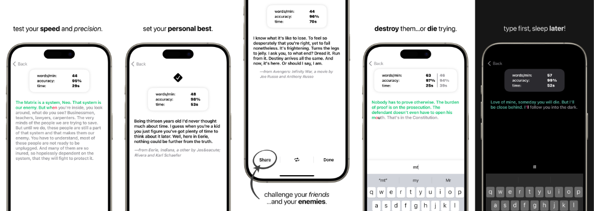

# Peck
## An iPhone type racer

### Test your typing speed and train until you’ve fully harnessed your mind, body, and keyboard.

#### Peck is a simple, minimal type racer designed to be a skill-building tool first, and a game second. Enjoy racing on tens of thousands of unique quotes. Get visual and tactile feedback to minimize your corrective reaction time. Practice day and night with the comfort of a pitch-back dark mode. Build your confidence up until you're flying like a modern day screen-addicted speed demon teen.

#### How it works? 
- Press the big button to jump into a race! You’ll be greeted with a random quote from pop culture, historic moments, or a familiar book.
- Type the quote that’s been selected for you. As you move along, characters will turn red or green as a visual indication of your correctness.
- If you make a mistake, go back and fix it.
- Performance is scored by WPM (words per minute), accuracy, and total time, all of which are update live throughout the race.
- Keep trying to up your score before throwing down the gauntlet by sharing your race results with a friend.

#### Need Help? Contact us!
Email: peckapp.help@gmail.com
